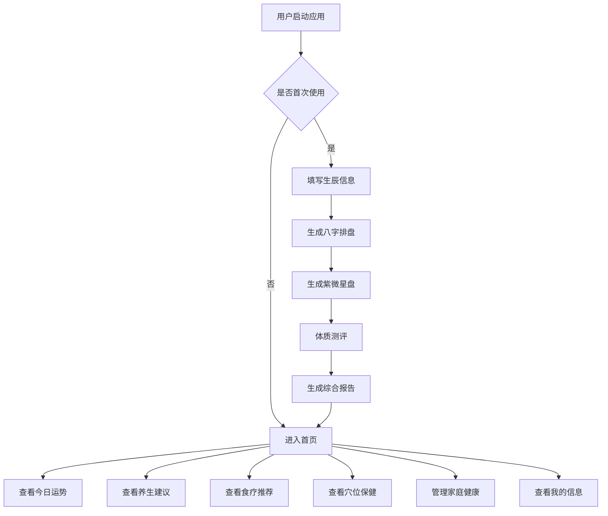

# 五行中医智能体 - 产品需求文档

## 1. 产品概述
五行中医智能体是一款融合传统中医理论与现代命理学的智能健康管理平台。通过用户的生辰信息，结合八字命理、紫微斗数、中医体质辨识等多维度分析，为用户提供个性化的养生建议、运势指导和健康管理方案，实现"天人合一"的健康理念。

**核心价值**：
- 传承中医智慧，结合现代科技，提供个性化健康指导
- 融合八字、紫微、体质等多维度分析，全方位解读个人命理与健康
- 以家庭为单位，关注全家人的健康福祉

## 2. 核心功能

### 2.1 用户角色
| 角色 | 注册方式 | 核心权限 |
|------|---------|---------|
| 普通用户 | 手机号/微信注册 | 浏览基础功能，填写生辰信息，查看个人报告 |
| VIP用户 | 付费升级 | 解锁高级功能，深度分析报告，家庭健康管理等 |

### 2.2 功能模块
1. **首页**：今日运势概览、快捷功能入口、养生资讯推荐
2. **生辰信息**：姓名、性别、出生日期时间、出生地点录入
3. **八字排盘**：四柱八字分析、五行强弱、十神配置
4. **紫微星盘**：命宫、身宫、十二宫位分析、星曜配置
5. **体质测评**：中医九种体质辨识问卷、体质特征分析
6. **综合报告**：多维度数据整合、个性化健康画像
7. **养生建议**：根据体质和八字提供起居、运动、情志建议
8. **今日运势**：每日运势更新、宜忌事项、吉凶方位
9. **食疗推荐**：体质食疗方案、节气养生食谱、食材功效
10. **穴位保健**：常用穴位查询、按摩手法指导、保健方案
11. **家庭健康**：家庭成员管理、家人健康档案、健康提醒
12. **我的信息**：个人资料、收藏记录、设置中心

### 2.3 页面详情
| 页面名称 | 模块名称 | 功能描述 |
|---------|---------|---------|
| 首页 | 今日运势卡片 | 显示今日运势评分、幸运色、幸运方位 |
| 首页 | 快捷功能入口 | 八字排盘、体质测评、养生建议等快捷入口 |
| 首页 | 养生资讯流 | 推送养生知识、节气养生、健康小贴士 |
| 生辰信息 | 基本信息表单 | 姓名、性别、出生日期时间输入 |
| 生辰信息 | 出生地点选择 | 省市区三级联动选择器 |
| 生辰信息 | 信息确认 | 信息预览与确认提交 |
| 八字排盘 | 四柱展示 | 年柱、月柱、日柱、时柱天干地支 |
| 八字排盘 | 五行分析 | 五行强弱图表、缺失五行提示 |
| 八字排盘 | 十神配置 | 十神关系图、性格特质分析 |
| 紫微星盘 | 命盘展示 | 十二宫位星曜分布图 |
| 紫微星盘 | 宫位解读 | 各宫位详细解读、星曜影响分析 |
| 体质测评 | 测评问卷 | 中医体质辨识标准化问卷 |
| 体质测评 | 结果展示 | 体质类型、特征描述、调理建议 |
| 综合报告 | 健康画像 | 多维度数据可视化展示 |
| 综合报告 | 分析报告 | 八字、紫微、体质综合分析报告 |
| 养生建议 | 起居建议 | 作息时间、睡眠质量建议 |
| 养生建议 | 运动建议 | 运动类型、强度、频率推荐 |
| 养生建议 | 情志调养 | 情绪管理、心理调节方法 |
| 今日运势 | 运势概览 | 今日整体运势评分与解读 |
| 今日运势 | 宜忌事项 | 今日宜做与忌做事项列表 |
| 今日运势 | 吉凶方位 | 财位、桃花位、文昌位等方位提示 |
| 食疗推荐 | 食疗方案 | 根据体质推荐食疗配方 |
| 食疗推荐 | 节气食谱 | 当季养生食谱推荐 |
| 食疗推荐 | 食材功效 | 常见食材性味归经、功效说明 |
| 穴位保健 | 穴位查询 | 穴位搜索、分类浏览 |
| 穴位保健 | 按摩指导 | 穴位定位、按摩手法视频/图文 |
| 穴位保健 | 保健方案 | 常见症状对应的穴位保健方案 |
| 家庭健康 | 成员管理 | 添加家庭成员、编辑成员信息 |
| 家庭健康 | 健康档案 | 家庭成员健康数据记录 |
| 家庭健康 | 健康提醒 | 用药提醒、体检提醒、养生提醒 |
| 我的信息 | 个人资料 | 头像、昵称、联系方式管理 |
| 我的信息 | 收藏记录 | 收藏的文章、食谱、穴位等 |
| 我的信息 | 设置中心 | 账号安全、通知设置、隐私设置 |

## 3. 核心流程

### 3.1 用户使用流程
用户首次进入应用 → 填写生辰信息（姓名、出生日期时间、地点） → 系统自动生成八字排盘和紫微星盘 → 用户完成体质测评 → 系统生成综合健康报告 → 用户查看个性化养生建议、今日运势、食疗推荐等 → 可添加家庭成员，管理全家健康

### 3.2 流程图

## 4. 用户界面设计

### 4.1 设计风格
**主题风格**：东方禅意 + 现代简约
- **主色调**：
  - 主色：深青色 (#1A4D5C) - 代表五行之水，智慧与宁静
  - 辅助色：琥珀黄 (#D4A84B) - 代表五行之土，温暖与稳重
  - 点缀色：朱砂红 (#C8553D) - 代表五行之火，活力与吉祥
  - 背景色：米白 (#F5F1E8) - 温润典雅
  - 文字色：墨黑 (#2C2416) - 沉稳大气

- **字体选择**：
  - 标题字体：思源宋体 (Source Han Serif) - 传统文化韵味
  - 正文字体：思源黑体 (Source Han Sans) - 现代易读
  - 装饰字体：方正清刻本悦宋 - 古典雅致

- **按钮样式**：
  - 圆角矩形按钮，圆角半径 8px
  - 主按钮：实心填充，带微妙的渐变和阴影
  - 次要按钮：描边样式，hover 时填充
  - 图标按钮：圆形背景，带涟漪动画效果

- **布局风格**：
  - 卡片式布局，卡片带柔和阴影和圆角
  - 顶部导航栏，底部标签栏（移动端）
  - 左侧固定导航（桌面端）
  - 留白充足，呼吸感强

- **图标风格**：
  - 线性图标为主，线条粗细 2px
  - 结合中国传统元素：太极、八卦、五行符号
  - 配色与主题色系统一致

### 4.2 页面设计概览
| 页面名称 | 模块名称 | UI元素 |
|---------|---------|--------|
| 首页 | 今日运势卡片 | 卡片式布局，背景渐变，运势评分用圆形进度条展示，幸运色用色块展示，幸运方位用指南针图标 |
| 首页 | 快捷功能入口 | 2x4网格布局，每个功能用圆形图标+文字标签，hover时图标旋转放大，背景色渐变 |
| 首页 | 养生资讯流 | 卡片列表，左侧图片，右侧标题和摘要，底部标签和发布时间，支持无限滚动加载 |
| 生辰信息 | 基本信息表单 | 表单卡片，输入框带图标前缀，日期时间选择器，性别单选按钮组，下一步按钮 |
| 生辰信息 | 出生地点选择 | 级联选择器，省市区三级联动，地图定位图标，当前定位按钮 |
| 八字排盘 | 四柱展示 | 四个竖向卡片，天干在上地支在下，每个柱用不同颜色标识五行属性，动画展示 |
| 八字排盘 | 五行分析 | 环形图表展示五行比例，缺失五行用虚线框标注，强弱用颜色深浅表示 |
| 紫微星盘 | 命盘展示 | 圆形命盘图，十二宫位扇形分布，星曜用不同图标和颜色表示，支持缩放和旋转 |
| 体质测评 | 测评问卷 | 进度条显示答题进度，问题卡片，选项按钮组，上一题/下一题导航 |
| 综合报告 | 健康画像 | 雷达图展示多维度数据，关键指标卡片，时间轴展示健康趋势 |
| 养生建议 | 分类建议 | 三个标签页（起居/运动/情志），每个标签下卡片列表，建议项带图标和优先级标识 |
| 今日运势 | 运势概览 | 大号运势评分，运势解读文字，吉凶指数条形图，今日箴言卡片 |
| 食疗推荐 | 食疗方案 | 食谱卡片，图片+标题+功效标签，收藏按钮，分享按钮，点击查看详情 |
| 穴位保健 | 穴位查询 | 搜索框，分类标签（头部/躯干/四肢），穴位列表，穴位详情弹窗 |
| 家庭健康 | 成员管理 | 家庭成员头像列表，添加成员按钮，成员详情卡片，健康档案时间轴 |
| 我的信息 | 个人资料 | 头像上传，表单字段，保存按钮，退出登录按钮 |

### 4.3 响应式设计
- **桌面优先**：设计以桌面端为主，大屏幕充分利用空间展示更多信息
- **移动端适配**：
  - 导航栏变为底部标签栏
  - 卡片布局变为单列
  - 字体大小适当调整
  - 触摸优化：按钮最小点击区域 44x44px
  - 手势支持：下拉刷新、滑动切换

### 4.4 动画与交互
- **页面过渡**：淡入淡出效果，持续时间 300ms
- **卡片动画**：hover 时轻微上浮，阴影加深
- **按钮交互**：点击涟漪效果，加载状态旋转动画
- **数据可视化**：图表渐进式绘制动画
- **命盘展示**：星曜旋转进入动画，宫位依次高亮

## 5. 特色功能亮点

### 5.1 智能命理分析
- 结合八字、紫微、体质三维度数据
- AI 驱动的个性化解读
- 动态更新的运势分析

### 5.2 中医养生指导
- 基于体质的精准食疗方案
- 节气养生智能提醒
- 穴位按摩视频指导

### 5.3 家庭健康管理
- 多成员健康档案
- 家庭健康报告汇总
- 用药和体检智能提醒

### 5.4 文化传承
- 传统命理文化科普
- 中医理论知识库
- 节气养生知识推送
