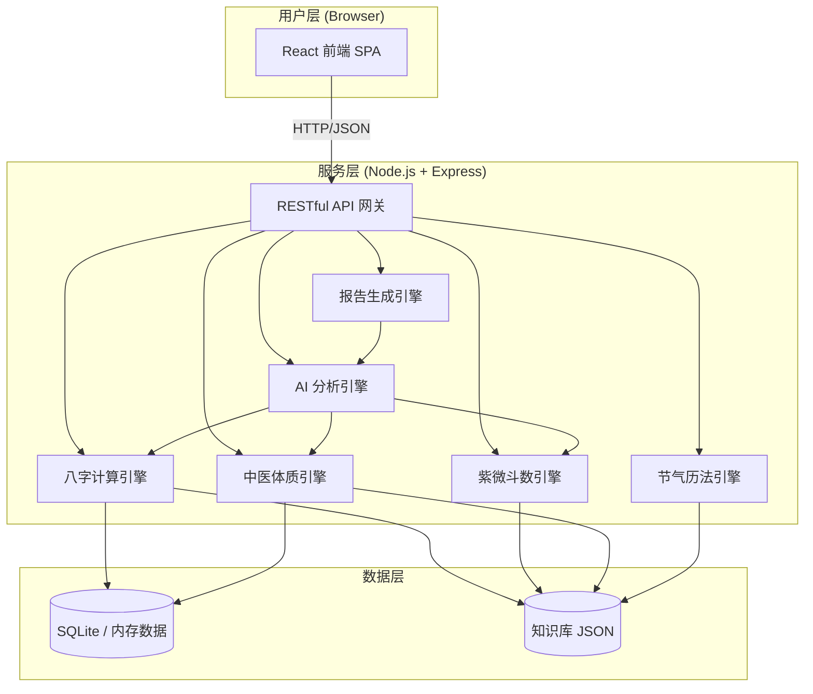
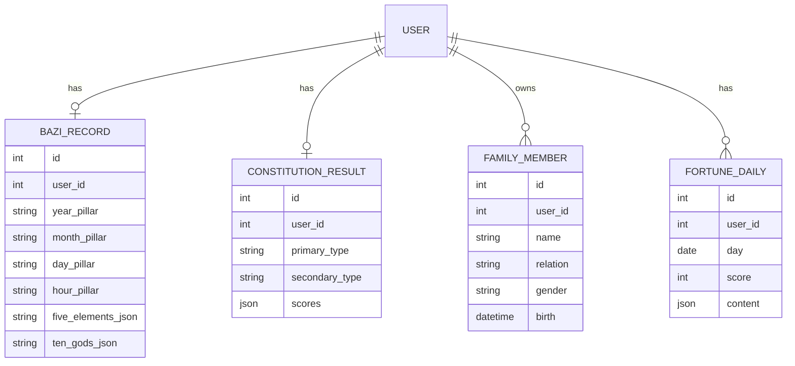
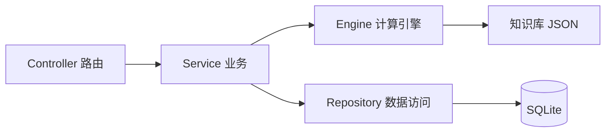

# 五行中医智能体 - 技术架构文档

## 1. 架构设计



## 2. 技术栈描述

- **前端**：React@18 + TypeScript@5 + Vite@5 + Tailwind CSS@3 + Zustand@4 + React Router@6 + lucide-react 图标 + ECharts 数据可视化
- **初始化工具**：vite-init
- **后端**：Express@4 + TypeScript@5（ESM 模式） + better-sqlite3（轻量数据库）
- **数据存储**：SQLite 存储用户/家庭成员/答题记录，JSON 文件存储知识库（穴位、食疗、体质辨识题库、八字排盘常量等）
- **跨域**：开发期通过 Vite 代理转发至后端

## 3. 目录结构

```
nature_and_humanity/
├── api/                          # 后端服务
│   ├── src/
│   │   ├── index.ts              # 入口
│   │   ├── routes/               # 路由：user, bazi, ziwei, constitution, report, fortune, food, acupoint, family
│   │   ├── engines/              # 计算引擎：bazi, ziwei, constitution, solar
│   │   ├── ai/                   # AI 分析：crossAnalysis, fiveElements, healthRisk
│   │   ├── data/                 # 知识库 JSON
│   │   ├── db/                   # SQLite 初始化与查询
│   │   └── types/                # 共享类型
│   ├── package.json
│   └── tsconfig.json
├── src/                          # 前端
│   ├── pages/                    # 12 个核心页面
│   ├── components/               # 通用组件
│   ├── layouts/                  # 布局
│   ├── stores/                   # zustand 状态
│   ├── api/                      # API 客户端
│   ├── hooks/                    # 自定义 hooks
│   ├── utils/                    # 工具函数
│   ├── styles/                   # 全局样式与主题
│   ├── App.tsx
│   ├── main.tsx
│   └── router.tsx
├── shared/                       # 前后端共享类型
├── index.html
├── package.json
├── tailwind.config.js
├── postcss.config.js
├── tsconfig.json
└── vite.config.ts
```

## 4. 路由定义

### 前端路由
| 路径 | 名称 | 说明 |
|------|------|------|
| / | 首页 | 今日运势、快捷入口、养生资讯 |
| /birth | 生辰信息 | 录入姓名、性别、出生时间地点 |
| /bazi | 八字排盘 | 四柱展示与五行分析 |
| /ziwei | 紫微星盘 | 十二宫位命盘 |
| /constitution | 体质测评 | 60 题问卷与结果 |
| /report | 综合报告 | 多维度健康画像 |
| /wellness | 养生建议 | 起居/运动/情志 |
| /fortune | 今日运势 | 每日运势详情 |
| /food | 食疗推荐 | 体质食疗+节气食谱 |
| /acupoint | 穴位保健 | 穴位查询与按摩 |
| /family | 家庭健康 | 家庭成员管理 |
| /profile | 我的信息 | 个人资料与设置 |

### 后端 API
| 方法 | 路径 | 用途 |
|------|------|------|
| GET | /api/health | 健康检查 |
| POST | /api/users | 创建/更新用户（姓名、性别、生辰、地点） |
| GET | /api/users/:id | 获取用户详情 |
| POST | /api/bazi | 根据生辰计算八字 |
| POST | /api/ziwei | 根据生辰计算紫微星盘 |
| GET | /api/constitution/questions | 获取体质测评题库 |
| POST | /api/constitution/evaluate | 提交答案计算体质 |
| POST | /api/report | 综合报告生成 |
| GET | /api/fortune/today | 今日运势 |
| GET | /api/food/recommend | 食疗推荐（基于体质） |
| GET | /api/acupoints | 穴位列表 |
| GET | /api/acupoints/:id | 穴位详情 |
| GET/POST/DELETE | /api/family | 家庭成员 CRUD |
| GET/PUT | /api/profile | 我的信息 |

## 5. 数据模型

### 5.1 数据模型定义



### 5.2 数据初始化
- 启动时自动创建 SQLite 表结构
- 内置知识库：60 道体质辨识题、108 个常用穴位、200+ 食疗方案、五行与天干地支映射表、十二宫位星曜对照表

## 6. 服务器架构



分层：
- **Controller (routes/)**：接收 HTTP 请求，参数校验
- **Service (services/)**：组合计算引擎与数据访问
- **Engine (engines/)**：八字/紫微/体质/节气的纯函数计算
- **AI (ai/)**：基于计算结果的 AI 交叉分析
- **Repository (db/)**：SQLite CRUD

## 7. 关键技术决策

1. **计算引擎本地实现**：八字排盘、紫微斗数、中医体质评分算法在 TypeScript 中实现，避免对外部 Python 服务的依赖，保证可移植性。
2. **知识库 JSON**：穴位、食疗、体质辨识题库以 JSON 形式存储，启动时加载到内存中以便快速查询。
3. **轻量数据库**：SQLite 适合单机演示和开发，无需额外服务。
4. **AI 分析本地化**：交叉分析、五行平衡、健康风险预测均通过规则引擎与加权算法实现，不依赖外部 LLM，保证离线可用。
5. **前后端分离**：开发期 Vite 代理转发 /api 至后端 4000 端口；生产期可同源部署。
6. **响应式 + 主题**：基于 PRD 的"东方禅意+现代简约"主题实现 CSS 变量化，深青、琥珀黄、朱砂红为主色，米白为底色。

## 8. 安全与性能
- 启用 CORS 白名单
- 请求体大小限制
- 输入参数 zod 校验
- 计算结果缓存（基于生辰+日期 hash）
- 前后端 TypeScript 严格模式
